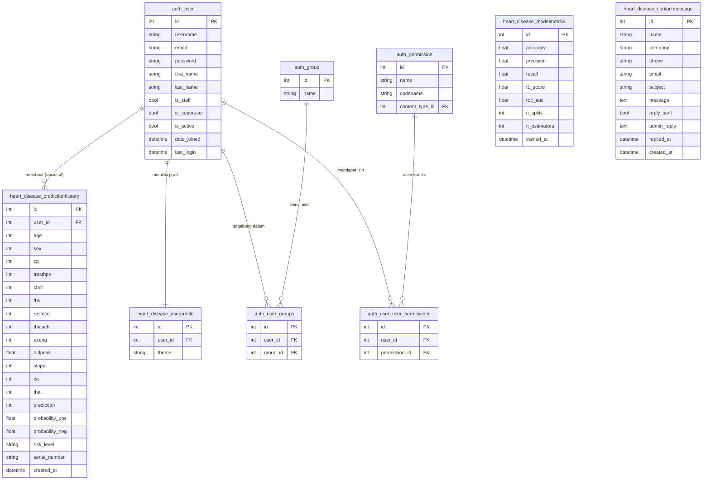

<div align="center">

# 💓 HeartGuard
### Sistem Prediksi Penyakit Jantung Berbasis Machine Learning

[](https://python.org)
[](https://djangoproject.com)
[](https://scikit-learn.org)
[](https://sqlite.org)
[](LICENSE)

*Proyek Akhir Mata Kuliah Pengembangan Sistem Informasi*

</div>

---

## 📌 Tentang Proyek

**HeartGuard** adalah sistem berbasis web untuk memprediksi risiko penyakit jantung menggunakan algoritma **Random Forest** dengan metode evaluasi **Multi-Holdout Validation**. Sistem ini dibangun menggunakan **Django** sebagai backend, **Scikit-learn** untuk model ML, dan menyediakan antarmuka yang intuitif untuk dokter maupun tenaga medis.

### ✨ Fitur Unggulan

| Fitur | Deskripsi |
|-------|-----------|
| 🤖 **Prediksi ML** | Random Forest dengan 13 fitur klinis pasien |
| 📊 **Visualisasi Lengkap** | Confusion Matrix, ROC Curve, Feature Importance, dll |
| 🔁 **Multi-Holdout Validation** | Evaluasi model dengan n-fold split yang dapat dikonfigurasi |
| 📋 **Riwayat Prediksi** | Semua prediksi tersimpan dengan nomor seri unik |
| 👥 **Manajemen Pengguna** | Role-based access (Admin & User biasa) |
| 🎨 **Tema Kustomisasi** | 4 pilihan tema warna (Blue, Green, Red, Purple) |
| 🌐 **Multi-bahasa** | Dukungan Bahasa Indonesia & Inggris |
| 📱 **QR Code** | Akses cepat dari perangkat mobile via QR |
| 📨 **Kontak & Balasan** | Sistem pesan kontak dengan balasan admin |
| 🔒 **Keamanan** | CSRF protection, rate limiting, SSL redirect |

---

## 🗂️ Struktur Proyek

```
heart_disease_project/
├── config/                         ← Konfigurasi Django
│   ├── settings.py
│   ├── urls.py
│   └── wsgi.py
│
├── heart_disease/                  ← Aplikasi utama
│   ├── ml_model.py                 ← Random Forest + Multi-Holdout Validation
│   ├── models.py                   ← Database models (4 model utama)
│   ├── views.py                    ← Controller / Business logic
│   ├── urls.py                     ← URL routing (20+ endpoint)
│   ├── admin.py                    ← Django Admin konfigurasi
│   ├── middleware.py               ← Rate limiting middleware
│   ├── context_processors.py      ← Global context (tema, bahasa)
│   ├── validators.py               ← Input validators
│   ├── translations.py             ← Terjemahan multi-bahasa
│   ├── templatetags/
│   │   └── custom_filters.py      ← Template filters kustom
│   └── templates/heart_disease/
│       ├── base.html               ← Layout utama
│       ├── index.html              ← Halaman beranda
│       ├── dashboard.html          ← Konfigurasi & latih model
│       ├── predict.html            ← Form prediksi klinis
│       ├── result.html             ← Hasil prediksi + QR code
│       ├── history.html            ← Riwayat prediksi
│       ├── prediction_detail.html  ← Detail prediksi per pasien
│       ├── about.html              ← Info tentang sistem
│       ├── login.html              ← Halaman login
│       ├── register.html           ← Halaman registrasi
│       ├── manage_users.html       ← Manajemen pengguna (Admin)
│       ├── manage_inquiries.html   ← Manajemen pesan kontak (Admin)
│       ├── model_integration.html  ← Upload & kelola model (Admin)
│       └── theme_selection.html    ← Pilihan tema
│
├── dataset/
│   └── heart.csv                   ← Dataset Heart Disease UCI (Kaggle)
├── media/
│   ├── models/                     ← Model .pkl & scaler tersimpan
│   └── plots/                      ← Grafik hasil training
├── static/                         ← CSS, JS, assets statis
├── colab_training/                 ← Notebook Google Colab (opsional)
├── .env.example                    ← Template konfigurasi environment
├── manage.py
├── requirements.txt
├── requirements-prod.txt
└── generate_sample_dataset.py      ← Generator dataset contoh
```

---

## 🗄️ Skema Database

Proyek menggunakan **Django ORM** dengan **SQLite**. Terdapat **4 model kustom** yang dikelompokkan bersama tabel bawaan Django Auth:



### 📋 Deskripsi Tabel

#### 🩺 `heart_disease_predictionhistory`
Menyimpan setiap hasil prediksi pasien. Field `user_id` bersifat **nullable** sehingga prediksi anonim tetap dapat disimpan.

| Kolom | Tipe | Keterangan |
|-------|------|------------|
| `prediction` | `int` | `0` = Tidak Sakit, `1` = Sakit Jantung |
| `risk_level` | `varchar(20)` | `Rendah` / `Sedang` / `Tinggi` |
| `serial_number` | `varchar(30)` | ID unik yang dapat di-share via QR Code |
| `probability_pos` | `float` | Probabilitas hasil positif (0.0 – 1.0) |
| `probability_neg` | `float` | Probabilitas hasil negatif (0.0 – 1.0) |

#### 📈 `heart_disease_modelmetrics`
Menyimpan hasil evaluasi model setiap kali pelatihan dilakukan. Menyimpan 5 metrik utama beserta hyperparameter yang digunakan (`n_splits`, `n_estimators`).

#### 👤 `heart_disease_userprofile`
Relasi **One-to-One** dengan `auth_user`. Menyimpan preferensi tampilan (tema warna: `blue`, `green`, `red`, `purple`) per pengguna.

#### 📨 `heart_disease_contactmessage`
Menampung pesan dari form kontak. Admin dapat membalas langsung dari panel manajemen, dengan status `reply_sent` dan timestamp `replied_at`.

---

## ⚡ Cara Menjalankan

### Prasyarat

- Python 3.10 atau lebih baru
- pip (Python package manager)
- Git

### 1. Clone Repository

```bash
git clone https://github.com/SofyanBaharudinnn/heart-disease-prediction.git
cd heart-disease-prediction
```

### 2. Buat & Aktifkan Virtual Environment

```bash
python -m venv venv

# Windows
venv\Scripts\activate

# macOS / Linux
source venv/bin/activate
```

### 3. Install Dependensi

```bash
pip install -r requirements.txt
```

### 4. Konfigurasi Environment

```bash
cp .env.example .env
# Edit .env sesuai kebutuhan (SECRET_KEY, ALLOWED_HOSTS, dll)
```

### 5. Siapkan Dataset

**Opsi A — Dataset asli dari Kaggle:**
> Download dari [Heart Disease Dataset (Kaggle)](https://www.kaggle.com/datasets/johnsmith88/heart-disease-dataset)
> Simpan sebagai `dataset/heart.csv`

**Opsi B — Dataset contoh (untuk testing cepat):**
```bash
python generate_sample_dataset.py
```

### 6. Migrasi Database

```bash
python manage.py makemigrations
python manage.py migrate
```

### 7. Buat Superuser (Admin)

```bash
python manage.py createsuperuser
```

### 8. Jalankan Development Server

```bash
python manage.py runserver
```

Buka browser dan akses: **http://127.0.0.1:8000**

---

## 🔄 Alur Penggunaan

```
1. Beranda (/)
   └── Overview sistem & fitur unggulan

2. Login / Register
   └── Autentikasi pengguna

3. Dashboard (/dashboard/)
   ├── Konfigurasi n_splits & n_estimators
   └── Latih model → simpan ke media/models/

4. Prediksi (/predict/)
   ├── Isi form 13 fitur klinis pasien
   └── Submit → proses prediksi real-time

5. Hasil (/result/)
   ├── Tampilkan prediksi + probabilitas
   ├── Tingkat risiko (Rendah / Sedang / Tinggi)
   └── QR code untuk akses cepat

6. Riwayat (/history/)
   └── Semua prediksi tersimpan dengan filter & detail

7. Admin Panel (/manage-users/, /manage-inquiries/)
   └── Kelola pengguna & pesan kontak
```

---

## 🧠 Metode Multi-Holdout Validation

```
Dataset (100%)
    │
    ├── Holdout 1: Train (70%) / Test (30%) → RF Model 1 → Metrics 1
    ├── Holdout 2: Train (70%) / Test (30%) → RF Model 2 → Metrics 2
    ├── Holdout 3: Train (70%) / Test (30%) → RF Model 3 → Metrics 3
    ├── Holdout 4: Train (70%) / Test (30%) → RF Model 4 → Metrics 4
    └── Holdout 5: Train (70%) / Test (30%) → RF Model 5 → Metrics 5
                                                              │
                                          ┌───────────────────┴──────────────────┐
                                          │   Rata-rata semua Metrik (avg ± std)  │
                                          │   Model Final dilatih dgn 100% data  │
                                          └──────────────────────────────────────┘
```

**Keunggulan metode ini:**
- Mengurangi bias evaluasi dari satu kali split
- Menghasilkan estimasi performa yang lebih stabil (mean ± std)
- Model final dilatih menggunakan **seluruh dataset** untuk prediksi yang lebih akurat

---

## 📊 Fitur Dataset (Heart Disease UCI)

| # | Fitur | Tipe | Keterangan |
|---|-------|------|------------|
| 1 | `age` | int | Usia pasien (tahun) |
| 2 | `sex` | int | Jenis kelamin: `0`=Perempuan, `1`=Laki-laki |
| 3 | `cp` | int | Tipe nyeri dada: `0`=Typical Angina, `1`=Atypical, `2`=Non-anginal, `3`=Asymptomatic |
| 4 | `trestbps` | int | Tekanan darah istirahat (mmHg) |
| 5 | `chol` | int | Kolesterol serum (mg/dl) |
| 6 | `fbs` | int | Gula darah puasa > 120 mg/dl: `0`=Tidak, `1`=Ya |
| 7 | `restecg` | int | Hasil ECG istirahat: `0`=Normal, `1`=ST-T Abnormal, `2`=LVH |
| 8 | `thalach` | int | Detak jantung maksimum yang dicapai |
| 9 | `exang` | int | Angina akibat olahraga: `0`=Tidak, `1`=Ya |
| 10 | `oldpeak` | float | ST depression akibat olahraga relatif terhadap istirahat |
| 11 | `slope` | int | Slope segmen ST: `0`=Upsloping, `1`=Flat, `2`=Downsloping |
| 12 | `ca` | int | Jumlah pembuluh darah mayor (0–4) |
| 13 | `thal` | int | Thalassemia: `0`=Normal, `1`=Fixed Defect, `2`=Reversable Defect |
| — | **`target`** | int | **Label: `0`=Tidak Sakit, `1`=Sakit Jantung** |

---

## 📈 Visualisasi yang Dihasilkan

Setelah training, sistem menghasilkan **6 jenis visualisasi** otomatis:

| Grafik | Deskripsi |
|--------|-----------|
| 🔲 **Confusion Matrix** | Matriks kesalahan prediksi gabungan semua holdout |
| 📉 **ROC Curve** | Kurva ROC dengan nilai AUC |
| 🌟 **Feature Importance** | Kontribusi setiap fitur terhadap prediksi |
| 📊 **Holdout Comparison** | Perbandingan Accuracy, F1, AUC per holdout |
| 🥧 **Distribusi Target** | Proporsi kelas positif vs negatif dalam dataset |
| 🔥 **Correlation Heatmap** | Korelasi antar seluruh fitur klinis |

---

## 🌐 Endpoint URL

| Method | URL | Deskripsi | Akses |
|--------|-----|-----------|-------|
| GET | `/` | Halaman beranda | Publik |
| GET/POST | `/dashboard/` | Latih & konfigurasi model | Login |
| GET/POST | `/predict/` | Form prediksi klinis | Login |
| GET | `/history/` | Riwayat prediksi | Login |
| GET | `/prediction/<id>/` | Detail prediksi | Login |
| POST | `/history/delete/<id>/` | Hapus riwayat | Login |
| GET | `/about/` | Tentang sistem | Publik |
| GET/POST | `/register/` | Registrasi akun | Publik |
| GET/POST | `/login/` | Login | Publik |
| POST | `/logout/` | Logout | Login |
| GET | `/manage-users/` | Kelola pengguna | Admin |
| POST | `/manage-users/delete/<id>/` | Hapus pengguna | Admin |
| POST | `/manage-users/toggle-admin/<id>/` | Toggle role admin | Admin |
| GET | `/manage-inquiries/` | Kelola pesan kontak | Admin |
| GET | `/model-integration/` | Upload & kelola model | Admin |
| POST | `/contact/submit/` | Kirim pesan kontak | Publik |
| GET | `/theme/` | Pilihan tema | Login |
| POST | `/toggle-language/` | Ganti bahasa | Login |

---

## 🛠️ Teknologi yang Digunakan

| Kategori | Teknologi | Versi |
|----------|-----------|-------|
| **Backend Framework** | Django | ≥4.2, <5.0 |
| **Machine Learning** | Scikit-learn | 1.3.2 |
| **Data Processing** | Pandas | 2.1.3 |
| **Numerik** | NumPy | 1.26.2 |
| **Visualisasi** | Matplotlib, Seaborn | 3.8.2, 0.13.0 |
| **Model Serialization** | Joblib | 1.3.2 |
| **QR Code** | qrcode[pil] | 7.4.2 |
| **Static Files (Produksi)** | WhiteNoise | 6.6.0 |
| **Image Processing** | Pillow | 10.1.0 |
| **Database** | SQLite (Django ORM) | — |
| **Frontend** | Bootstrap 5, Bootstrap Icons | 5.x |

---

## 🔒 Konfigurasi Keamanan (Produksi)

Salin `.env.example` ke `.env` dan sesuaikan nilai berikut:

```env
# Wajib diubah di produksi!
DJANGO_SECRET_KEY=your-very-long-random-secret-key-here

# Matikan mode debug di produksi
DJANGO_DEBUG=False

# Daftar host yang diizinkan
DJANGO_ALLOWED_HOSTS=yourdomain.com,www.yourdomain.com,127.0.0.1

# Aktifkan SSL redirect jika server mendukung HTTPS
DJANGO_SECURE_SSL_REDIRECT=True
```

---

## 🚀 Deploy ke Produksi

### PythonAnywhere / VPS

```bash
# Install dependensi produksi
pip install -r requirements-prod.txt

# Kumpulkan file statis
python manage.py collectstatic --noinput

# Jalankan migrasi
python manage.py migrate
```

### Demo / Presentasi dengan ngrok

```bash
# Terminal 1 — jalankan server Django
python manage.py runserver

# Terminal 2 — expose ke internet
./ngrok http 8000
```

---

## 🤝 Kontribusi

1. Fork repository ini
2. Buat branch fitur baru: `git checkout -b feature/nama-fitur`
3. Commit perubahan: `git commit -m 'feat: tambah fitur X'`
4. Push ke branch: `git push origin feature/nama-fitur`
5. Buat Pull Request

---

## 📄 Lisensi

Proyek ini dilisensikan di bawah [MIT License](LICENSE).

---

<div align="center">

**HeartGuard** — Dibuat dengan ❤️ untuk Proyek Akhir Pengembangan Sistem Informasi


</div>
